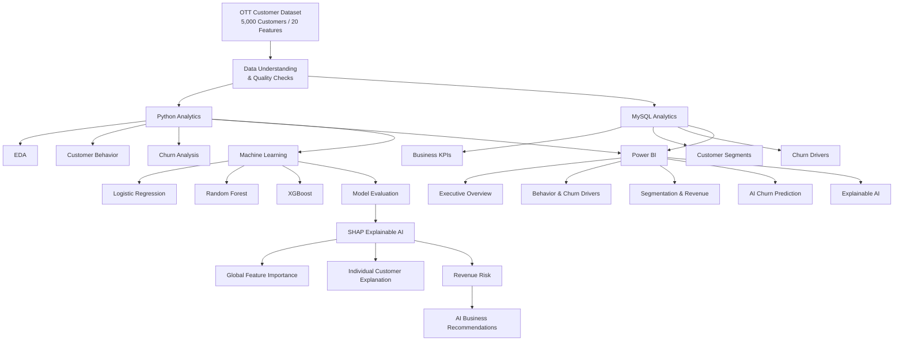

# 📺 AI-Powered OTT Customer Churn & Revenue Intelligence Platform

<p align="center">
  <strong>End-to-End Data Analytics • Machine Learning • Explainable AI • Business Intelligence</strong>
</p>

<p align="center">


</p>

---

## 📌 Executive Summary

**AI-Powered OTT Customer Churn & Revenue Intelligence Platform** is an end-to-end analytics and machine learning project designed to help an OTT business understand customer churn, identify behavioral churn drivers, predict customers at risk, explain model predictions, and estimate potential revenue exposure.

The project combines:

**Python + SQL + Power BI + Machine Learning + SHAP + Customer Segmentation + Revenue Analytics**

Instead of stopping at a churn prediction model, the project transforms raw customer data into a complete business intelligence workflow.

```text
Raw Customer Data
       ↓
Data Quality & Understanding
       ↓
Python Exploratory Data Analysis
       ↓
MySQL Business Analytics
       ↓
Power BI Executive Dashboard
       ↓
Machine Learning Churn Prediction
       ↓
SHAP Explainable AI
       ↓
Customer Segmentation
       ↓
Revenue Risk Analysis
       ↓
AI Business Recommendations
```

---

# 🎯 Business Problem

Subscription-based OTT platforms depend heavily on customer retention.

When customers leave, the business loses recurring revenue.

The objective of this project was to answer:

* Which customers are churning?
* Which customer segments have higher churn?
* What behaviors are associated with churn?
* Does inactivity indicate higher churn risk?
* How does engagement relate to retention?
* Which customers are likely to churn?
* Why does the model classify a customer as high risk?
* What monthly revenue is potentially exposed to churn?
* How can analytics be translated into actionable business recommendations?

---

# 📊 Project at a Glance

| Category           | Details                                     |
| ------------------ | ------------------------------------------- |
| Dataset            | OTT Customer Dataset                        |
| Customers          | 5,000                                       |
| Features           | 20                                          |
| Churned Customers  | 958                                         |
| Active Customers   | 4,042                                       |
| Overall Churn Rate | 19.16%                                      |
| Database           | MySQL                                       |
| BI Tool            | Power BI                                    |
| ML Models          | Logistic Regression, Random Forest, XGBoost |
| Explainability     | SHAP                                        |
| Segmentation       | K-Means                                     |
| Programming        | Python                                      |
| Analytics          | Python + SQL                                |
| Dashboard          | 5-page Power BI solution                    |

---

# 🧰 Technology Stack

### Programming & Analytics

* Python
* Pandas
* NumPy
* Matplotlib
* Seaborn

### Database & SQL

* MySQL
* Aggregations
* `CASE WHEN`
* `GROUP BY`
* KPI calculations
* Segmentation queries

### Business Intelligence

* Power BI
* DAX
* KPI Cards
* Slicers
* Interactive Visualizations
* Executive Dashboard Design

### Machine Learning

* Scikit-learn
* Logistic Regression
* Random Forest
* XGBoost
* K-Means Clustering

### Explainable AI

* SHAP
* Global Feature Importance
* Individual Customer Explanations

### Development

* Jupyter Notebook
* Git
* GitHub

---

# 🏗️ Solution Architecture



---

# 🔄 End-to-End Workflow

```text
                    BUSINESS PROBLEM
                          │
                          ▼
                 DATA UNDERSTANDING
                          │
                          ▼
              ┌───────────────────────┐
              │ Python Data Analytics │
              └───────────┬───────────┘
                          │
                          ▼
                 BEHAVIORAL INSIGHTS
                          │
              ┌───────────┴───────────┐
              ▼                       ▼
           MySQL                  Power BI
              │                       │
              └───────────┬───────────┘
                          ▼
                  BUSINESS INSIGHTS
                          │
                          ▼
                 MACHINE LEARNING
                          │
             ┌────────────┼────────────┐
             ▼            ▼            ▼
        Logistic RF     XGBoost
             │            │            │
             └────────────┼────────────┘
                          ▼
                   MODEL EVALUATION
                          │
                          ▼
                       SHAP
                          │
             ┌────────────┴────────────┐
             ▼                         ▼
       Global Drivers         Customer Explanation
             │                         │
             └────────────┬────────────┘
                          ▼
                    REVENUE RISK
                          │
                          ▼
                BUSINESS ACTIONS
```

---

# 🔎 01 — Data Understanding & Quality

The first stage focused on understanding the structure and quality of the customer dataset.

### Data Quality Checks

```python
df.shape
df.info()
df.isnull().sum()
df.duplicated().sum()
df.describe()
```

### Results

```text
Rows:              5,000
Columns:           20
Missing Values:    0
Duplicate Rows:    0
Active Customers:  4,042
Churned Customers: 958
Churn Rate:        19.16%
```

This established a clean starting point for the analytics and ML pipeline.

---

# 🐍 02 — Python Analytics

Python was used to perform exploratory and behavioral analysis.

### Main Areas

* Customer demographics
* Subscription behavior
* Pricing
* Engagement
* Login frequency
* Watch time
* Support activity
* Streaming quality
* Customer inactivity
* Churn reasons

---

## 📈 Churn Distribution

The customer population was divided into:

```text
Active Customers   → 4,042
Churned Customers  →   958
```

Overall churn:

```text
19.16%
```

---

# 👥 Customer Segmentation Analysis

Customers were grouped into meaningful business segments.

### Age Groups

```text
18–25
26–35
36–45
46–55
56+
```

### Charge Groups

```text
0–20
20–40
40–60
60–80
80+
```

### Engagement Groups

```text
0–5 hours
6–10 hours
11–20 hours
21–40 hours
40+
```

These transformations made the analysis easier to interpret for business stakeholders.

---

# 🗄️ 03 — MySQL Business Analytics

The project includes a complete SQL analysis layer.

Database:

```sql
CREATE DATABASE ott_churn_db;
```

Main table:

```text
ott_customer_churn
```

The SQL layer calculates:

* Total customers
* Active customers
* Churned customers
* Overall churn rate
* Churn by age
* Churn by gender
* Churn by region
* Churn by subscription plan
* Churn by contract
* Churn by auto-renewal
* Churn by monthly charges
* Churn by watch hours
* Churn by support calls
* Churn by inactivity
* Churn by devices
* Churn by offline downloads
* Churn by login frequency
* Churn by streaming quality issues

---

# 📊 04 — Power BI Dashboard

The Power BI solution was designed as an executive-level customer and churn intelligence dashboard.

## Dashboard Pages

### Page 1 — Executive Summary

Focus:

* Total customers
* Churned customers
* Churn rate
* Monthly revenue
* Average charges
* Plan-level churn
* Contract-level churn
* Region-level churn
* Auto-renewal analysis

---

### Page 2 — Customer Behavior & Churn Drivers

Focus:

* Watch engagement
* Login frequency
* Inactivity
* Support calls
* Streaming quality
* Devices
* Offline downloads

---

### Page 3 — Customer Segmentation & Revenue

Focus:

* Customer segments
* Subscription behavior
* Revenue contribution
* Churn exposure
* Customer value

---

### Page 4 — AI Churn Prediction & Revenue Risk

Focus:

* Customer-level predictions
* Churn probability
* Risk levels
* Monthly charges
* Revenue at risk

---

### Page 5 — Explainable AI & Recommendations

Focus:

* SHAP feature importance
* Customer-level explanations
* Main churn drivers
* AI recommendations
* Retention actions

---
# 🤖 05 — Machine Learning

The project moves from descriptive analytics to predictive analytics.

### Prediction Target

```text
Churn_Status
```

The target was converted into a binary classification problem.

---

# 🧹 Feature Preprocessing

The ML pipeline separates:

### Numerical Features

* Age
* Monthly Charges
* Watch Hours
* Login Frequency
* Days Since Last Login
* Customer Support Calls
* Streaming Quality Issues
* Devices
* Offline Downloads

### Categorical Features

* Gender
* Region
* Subscription Plan
* Payment Method
* Auto Renewal
* Contract Length
* Favorite Genre

Categorical features were transformed using One-Hot Encoding.

---

# 🧪 Model Comparison

Three classification models were evaluated.

| Model               | Accuracy | Precision | Recall |     F1 | ROC-AUC |
| ------------------- | -------: | --------: | -----: | -----: | ------: |
| Logistic Regression |    0.809 |    0.5217 | 0.0625 | 0.1116 |  0.7506 |
| Random Forest       |    0.811 |    0.7143 | 0.0260 | 0.0503 |  0.7026 |
| XGBoost             |    0.804 |    0.4444 | 0.0833 | 0.1404 |  0.7017 |

### Why Multiple Metrics?

Accuracy alone can hide problems in classification.

For churn prediction, the project therefore evaluates:

* Accuracy
* Precision
* Recall
* F1 Score
* ROC-AUC

The relatively low recall values are an important limitation of the current model and should be considered before using predictions operationally.

---

# 🔍 06 — Explainable AI with SHAP

SHAP was used to understand **why the model makes predictions**.

Instead of only showing:

```text
Customer Churn Probability = 72%
```

the system can explain:

```text
Why is this customer at risk?
```

---

# 🌎 Global SHAP Analysis

Global feature importance identifies variables that have the greatest overall influence on model predictions.

Important behavioral signals identified during the project included:

```text
Average Watch Hours
Days Since Last Login
Login Frequency
```

---

# 👤 Individual Customer Explanation

For an individual customer, the system can show:

```text
Customer
   ↓
Churn Probability
   ↓
Risk Level
   ↓
Top SHAP Drivers
   ↓
Recommended Action
```

This connects Machine Learning with business decision-making.

---

# 💰 07 — Revenue Risk

The project translates churn probability into potential revenue exposure.

Conceptually:

```text
Revenue at Risk
=
Churn Probability × Monthly Charges
```

Example:

```text
Monthly Charges = $40

Churn Probability = 75%

Revenue at Risk
= $40 × 0.75
= $30
```

This provides a business-oriented interpretation of ML predictions.

---

# 👥 08 — Customer Segmentation

K-Means clustering was introduced to identify behavioral customer groups.

Unlike churn prediction:

```text
Churn Prediction
→ Who might leave?
```

Segmentation asks:

```text
Customer Segmentation
→ What type of customer is this?
```

Potential clustering inputs include:

* Watch hours
* Login frequency
* Monthly charges
* Devices
* Support calls
* Engagement behavior

---

# 🤖 09 — AI Business Recommendations

The final layer transforms analytics into potential business actions.

```text
Customer Data
      ↓
Churn Prediction
      ↓
Risk Level
      ↓
SHAP Explanation
      ↓
Revenue Risk
      ↓
Recommended Action
```

### Example

```text
High churn probability
+
Low watch engagement
+
Long inactivity
        ↓
Re-engagement strategy
```

Another example:

```text
High churn probability
+
Repeated streaming problems
        ↓
Technical support intervention
```

These are **decision-support recommendations**, not automatic causal conclusions.

---

# 💡 Key Business Findings

The analysis identified several notable patterns in the dataset.

### Subscription

Monthly-contract customers had a higher observed churn rate than annual-contract customers.

```text
Monthly → 21.04%
Annual  → 15.21%
```

### Auto-Renewal

```text
Auto Renewal = No  → 23.52%
Auto Renewal = Yes → 17.71%
```

### Subscription Plan

```text
Premium  → 23.04%
Standard → 19.09%
Basic    → 16.91%
```

### Engagement

Customers with 0–5 weekly watch hours showed approximately:

```text
32.49% churn
```

These findings describe relationships observed in the dataset; they should not be interpreted as proof of causation.

---

# 📈 Business Value

This project demonstrates how an analytics team could move from raw customer records to business decision support.

### For Executives

Monitor:

* Churn rate
* Customer volume
* Revenue
* Customer risk

### For Marketing

Identify:

* At-risk customers
* Low-engagement customers
* Re-engagement opportunities

### For Product Teams

Investigate:

* Streaming problems
* Engagement decline
* Customer behavior patterns

### For Customer Success

Prioritize:

* High-risk customers
* Customers with repeated support interactions
* Customers with long inactivity periods

### For Data Teams

Build:

* Reproducible analytics
* ML pipelines
* Explainable models
* Business dashboards

---

---

# 📦 Installation

Clone the repository:

```bash
git clone https://github.com/YOUR_USERNAME/AI-Powered-OTT-Customer-Churn.git
```

Navigate into the project:

```bash
cd AI-Powered-OTT-Customer-Churn
```

Install dependencies:

```bash
pip install -r requirements.txt
```

---

# 📋 Requirements

Example:

```text
pandas
numpy
matplotlib
seaborn
scikit-learn
xgboost
shap
jupyter
```

---
# 🧠 What This Project Demonstrates

This project demonstrates practical ability across the complete analytics lifecycle:

```text
✔ Data Understanding
✔ Data Quality Validation
✔ Python Analytics
✔ Exploratory Data Analysis
✔ SQL Business Analysis
✔ KPI Development
✔ Power BI Dashboarding
✔ DAX
✔ Machine Learning
✔ Classification
✔ Model Evaluation
✔ Explainable AI
✔ SHAP
✔ Customer Segmentation
✔ Revenue Risk Analysis
✔ Business Recommendations
```

---

# 🎓 Key Learning Outcomes

Through this project, I practiced how to:

* Translate a business problem into analytical questions
* Explore and validate structured customer data
* Perform behavioral churn analysis using Python
* Write business-focused SQL queries
* Build interactive Power BI dashboards
* Prepare data for machine learning
* Compare multiple classification models
* Evaluate models using multiple metrics
* Explain predictions using SHAP
* Segment customers using clustering
* Connect ML predictions to revenue metrics
* Translate analytical findings into business actions

---
# 👩‍💻 Author

## Aatiqa Noohani

**AI & Data Analyst | Python | SQL | Power BI | Machine Learning**

Interested in:

* Data Analytics
* Business Intelligence
* Machine Learning
* Explainable AI
* AI Applications

---

# ⭐ Project Highlight

> **Turning raw OTT customer data into actionable churn, revenue, and customer intelligence using Python, SQL, Power BI, Machine Learning, and Explainable AI.**

---

## 📌 Recruiter Snapshot

```text
Business Problem
       ↓
5,000 Customer Dataset
       ↓
Python EDA
       ↓
MySQL Analytics
       ↓
Power BI Dashboard
       ↓
3 ML Models
       ↓
SHAP Explainability
       ↓
Customer Segmentation
       ↓
Revenue Risk
       ↓
Business Recommendations
```

**This project demonstrates an end-to-end ability to move from data → insight → prediction → explanation → business action.**
